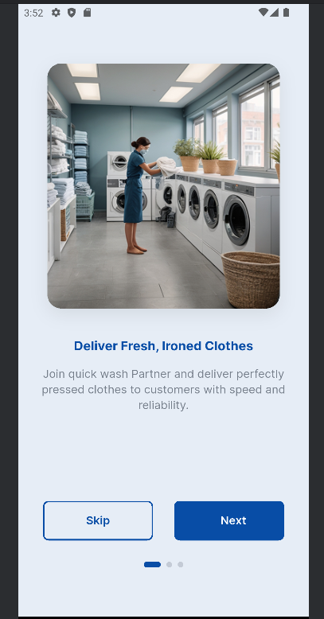
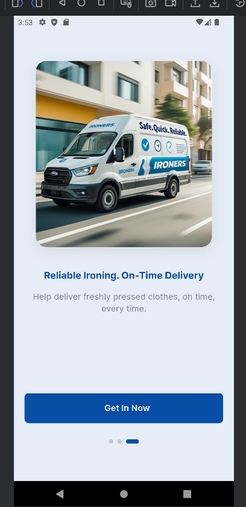
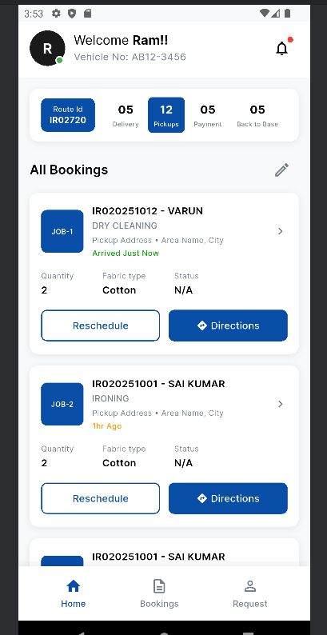
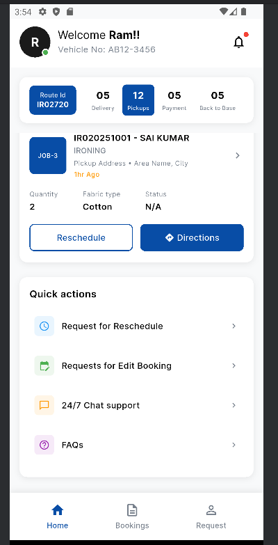
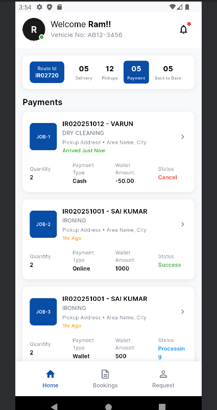

---

## 🎨 Design Specifications

### **Color Palette**
| Purpose | Color |
|--------|--------|
| Primary Blue | `#084DA6` |
| Light Blue | `#E6EDF6` |
| Text Gray | `#757E8A` |
| White | `#FFFFFF` |

---

## 🖥️ Screens Overview

### **1️⃣ Splash Screen**
- Background: Primary Blue
- Auto-navigates after 3 seconds
- Shows Quick Wash branding

### **2️⃣ Intro Screens**
- Three intro pages
- Light Blue background
- Page indicators
- Skip / Next buttons (pages 1–2)
- Get In Now button (page 3)

### **3️⃣ Home Screen**
- Top tab navigation:
  - 05 Delivery
  - 12 Pickups
  - 05 Payments
  - 05 Back to Base  
- Dynamic card data updates when a tab is selected
- Quick actions section

---

## 📸 Screenshots

> Place your screenshots inside:  
> **`assets/screenshots/`**  
> File names: **sc1.png → sc8.png**

### **App Screenshots**

<p align="center">
  
  
  
</p>

<p align="center">
  
  
  
</p>

<p align="center">
  
  
</p>

---

## 🧩 Reusable Components

### **CustomButton**
- Supports primary & secondary styles  
- Customizable size, radius, and text

### **PageIndicator**
- Animated active/inactive states  

### **IntroPageWidget**
- Shows image, title, subtitle  
- Fully responsive  

---

## 🚀 Running the App

```bash
flutter pub get
flutter run
